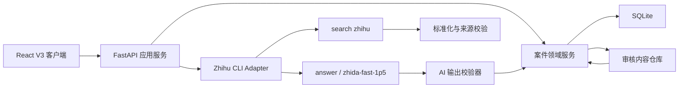
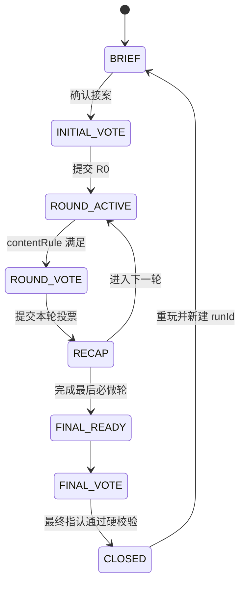

# 看山侦探事务所 V3.0 技术方案与技术设计

版本：V3.0 Draft 1  
日期：2026-08-14  
对应产品：CASE 001《失踪的45分钟》产品开发方案  
范围：桌面端＋手机竖屏精品 MVP，固定案件，匿名进度，SQLite，知乎搜索与知乎直答

## 1. 评审结论

V3 产品方案可开发，核心玩法、七轮反转、证据边界、投票轨迹和最终指认已经形成完整闭环。技术上不建议继续在 V2 的“五任务＋拼图＋一次推理”模型上叠加条件，而应采用以下路线：

- 复用基础设施：React/Vite、FastAPI、SQLite、Docker、CLI 安装、静态资源和部署方式。
- 重做领域模型：状态机、轮次进度、内容行为、证据、投票、AI 对话、前情提示和最终指认。
- 保留固定案件真相：医学事实、嫌疑人作用、时间点和证据边界全部由人工审核配置。
- 接入真实知乎能力：R1/R7 使用 `search zhihu`，R5 和投票后 recap 使用 `answer`。
- AI 不成为事实源：直答只整理已知证据、比较解释和指出缺口；输出越界时立即使用模板。
- 先实现完整静态闭环，再接真实搜索和直答，任何外部能力中断都不能阻断结案。

V3 是一次产品结构重构，不是 V2 的局部页面升级。现有 V2 数据和报告应保留只读兼容，新 V3 run 使用新的 `caseVersion=3`。

## 2. 研发口径与冲突处理

### 2.1 终端范围

V3 同时支持桌面端与手机竖屏，功能完整度一致，不为移动端删减轮次、搜索、直答、投票、案件板或最终指认。

桌面端：

- 主验收：1440x900。
- 兼容验收：1366x768。
- 桌面内容安全宽度：1180-1440px。

移动端：

- 主验收：390x844。
- 兼容验收：375x812。
- 仅支持竖屏手机；不验收平板和横屏。
- 主要运行在普通手机浏览器，兼容当前主流 Chrome 和 Safari。
- 需要实现底部操作栏、软键盘避让、`safe-area-inset-*` 和滚动恢复。
- 桌面三栏布局在移动端重排为单栏页面、抽屉、标签页和底部面板，不做整体缩放。

响应式断点建议：

- `>= 1180px`：桌面布局。
- `<= 767px`：手机单栏布局。
- `768-1179px`：使用限制宽度的单栏布局，不作为正式验收目标。

### 2.2 P0 轮次范围

P0 交付 R0 初始判断、R1-R7、最终指认和报告。R7 使用配置驱动的动态分支：根据 R6 当前票选择推荐关键词和比较问题，不由 AI 临时生成案件事实。

若演示工期需要压缩，可以用 feature flag 隐藏 R7；状态机和配置仍保留 R7，避免后续再改数据结构。

### 2.3 知乎能力边界

当前 `zhihu-cli 0.3.0` 运行时能力如下：

| 能力 | 可用命令 | V3 用途 |
|---|---|---|
| 知乎搜索 | `search zhihu` | R1、R7 真实内容搜索和来源回溯 |
| 知乎直答 | `answer` | R5 双轮 AI 协查、投票后 recap，可选结案点评 |
| 阅读正文 | 无对应 CLI 命令 | 使用人工审核快照＋原文外链 |
| 评论列表 | 无对应 CLI 命令 | 使用人工审核评论快照＋原文外链 |
| 发布 | 本项目不接入 | 只复制草稿并打开知乎，由用户确认 |

当前直答支持 `zhida-fast-1p5`、`zhida-thinking-1p5` 和 `zhida-agent`，但 CLI 只接受 query/model 等参数，没有 source allowlist 或自定义 system message 参数，实测响应也不保证返回结构化 citation。因此：

- 来源卡由应用自己的审核来源表提供，不能相信 AI 自报来源。
- AI query 中可以携带紧凑的已知证据摘要和允许使用的来源编号。
- 输出必须经过服务端事实、编号、禁用表达和长度校验。
- 不能把直答输出标记为“基于玩家选中证据的严格推理结果”。
- 校验失败、超时或拒绝时使用固定模板，不重试直答 POST。

## 3. 总体架构



### 3.1 分层职责

| 层 | 职责 |
|---|---|
| React 客户端 | 页面呈现、局部草稿、内容行为上报、服务端状态渲染 |
| FastAPI 路由 | 参数校验、认证边界、幂等键、错误码、响应 DTO |
| CaseService | 状态迁移、轮次完成判断、证据创建、投票、最终校验 |
| ContentService | 审核来源、快照、摘录、身份和限制字段 |
| ZhihuCliAdapter | 搜索、直答、超时、输出解析、错误归一化 |
| AiGuard | 允许事实、来源编号、禁用表达、安全和 fallback 判定 |
| SQLite Repository | 事务、快照、幂等记录、事件和报告持久化 |

### 3.2 目录建议

```text
src/
  app/
    router.tsx
    AppProvider.tsx
  features/
    case-brief/
    round/
    source-reader/
    evidence/
    voting/
    companion/
    board/
    final-decision/
    report/
  components/
  api/
  types/
  styles/
server/
  app.py
  models.py
  services/
    case_service.py
    round_service.py
    evidence_service.py
    assistant_service.py
    report_service.py
  repositories/
    run_repository.py
  adapters/
    zhihu_cli.py
  validators/
    ai_guard.py
  db.py
data/
  seeds/
    case_001_v3.json
    source_snapshots.case_001_v3.json
    recap_templates.case_001_v3.json
  migrations/
```

P0 可以继续使用 Python 标准库 `sqlite3`，不强制引入 ORM。服务拆分的目标是隔离状态和外部调用，不是做微服务。

## 4. V3 状态机



### 4.1 稳定状态

服务端只保存稳定状态：

- `BRIEF`
- `INITIAL_VOTE`
- `ROUND_ACTIVE`
- `ROUND_VOTE`
- `RECAP`
- `FINAL_READY`
- `FINAL_VOTE`
- `CLOSED`

页面内部的搜索输入、抽屉展开和滚动位置属于 UI 草稿，不直接推动状态迁移。`lastStableState` 和 `lastPage` 分开保存。

### 4.2 状态不变量

- 每个 run 固定 `caseId + caseVersion`，运行中不能切换配置版本。
- R0-R7 每轮最多一条已提交 Vote，使用 `UNIQUE(run_id, round_id)`。
- 轮次投票提交后不可覆盖，只能在下一轮形成新判断。
- 只有服务端 `contentRule` 计算通过后才能进入 `ROUND_VOTE`。
- recap 失败不阻断下一轮，但必须落一条模板 Recap。
- `currentRound` 只在 recap 阅读或跳过后递增。
- 客户端不得上传 evidence 的 `eligibleForFinal`、`reliability` 或官方关系。
- CLOSED run 不再接受内容行为、证据、投票和最终提交写入。

## 5. 案件配置设计

### 5.1 CaseConfig V3

```json
{
  "caseId": "case_001",
  "version": 3,
  "title": "失踪的45分钟",
  "suspects": [],
  "timeline": [],
  "rounds": [],
  "sources": [],
  "evidenceBlueprints": [],
  "truth": {},
  "recapTemplates": {},
  "safety": {},
  "report": {}
}
```

配置启动时完成 JSON Schema 校验。校验失败应使应用进入明确错误态，不能带着半份案件运行。

### 5.2 RoundConfig

```json
{
  "roundId": "R3",
  "index": 3,
  "title": "不记得的三次醒来",
  "storyClueIds": ["AUDIO_001", "WAKE_001"],
  "contentMode": "comment_snapshot",
  "contentRule": {
    "answerOpen": 1,
    "commentsViewed": 3,
    "supportMarked": 1,
    "challengeMarked": 1,
    "hypothesisSelected": 1
  },
  "evidenceRewards": ["E05", "E06"],
  "voteRequired": true,
  "nextHookId": "HOOK_WORK_MESSAGE",
  "fallbackTemplateGroup": "R3"
}
```

`contentMode` 建议支持：

- `search`
- `professional_snapshot`
- `comment_snapshot`
- `research_snapshot`
- `assistant`
- `comparison_snapshot`
- `targeted_search`

### 5.3 SourceSnapshot

每个审核来源包含：

- `sourceId`、`sourceUrl`、`title`、`authorName`。
- `authorType`、`professionalIdentity`、`identityVerifiedBy`。
- `contentType`、`publishedAt`、`availability`。
- `approvedExcerpts[]`、`commentsSnapshot[]`。
- `supports[]`、`weakens[]`、`limitations[]`。
- `backupSourceId`、`reviewer`、`reviewedAt`、`contentVersion`。

身份和医学字段必须来自平台字段或人工审核，运行时 AI 不得创建。

## 6. SQLite 数据设计

V3 采用“聚合快照＋关键行为规范化表”。`player_cases.state_json` 保留快速恢复快照，投票、证据、AI 调用和最终决定进入独立表，便于幂等和验收。

### 6.1 保留并扩展

#### `case_configs`

增加 `schema_version`、`published_at` 和 `status`。主键建议改为 `(case_id, version)`。

#### `player_cases`

增加：

- `case_version integer not null`
- `current_round integer not null default 0`
- `last_stable_state text not null`
- `closed_at text null`

### 6.2 新增表

#### `round_progress`

| 字段 | 说明 |
|---|---|
| `run_id + round_id` | 联合主键 |
| `status` | ACTIVE/READY_TO_VOTE/VOTED/RECAP_DONE |
| `actions_json` | 完成规则计数和行为摘要 |
| `task_complete` | 服务端计算结果 |
| `recap_read` | 已读或已跳过 |
| `updated_at` | 更新时间 |

#### `content_actions`

| 字段 | 说明 |
|---|---|
| `action_id` | 客户端生成幂等 ID |
| `run_id`、`round_id` | 归属 |
| `action_type` | SEARCH/SOURCE_OPEN/IDENTITY_VIEW/COMMENT_VIEW/EXCERPT_MARK 等 |
| `source_id` | 可空 |
| `payload_json` | 非可信行为参数，服务端二次校验 |
| `created_at` | 时间 |

#### `evidence_records`

保存玩家实际获得的证据快照。字段包括 blueprint ID、来源快照、摘录、关系、嫌疑人、可靠性、限制和是否可进入最终证据槽。创建后不随线上来源变化而丢失。

#### `votes`

`vote_id` 主键，`UNIQUE(run_id, round_id)`；保存 suspect、role、confidence、reason_evidence_id 和前一票，R0 的 reason 可空。

#### `assistant_turns`

保存 R5 两轮问答：问题、模型、答案、允许来源 ID、应用挂载的 citation ID、安全结果、fallback、延迟和输出版本。

#### `recaps`

`UNIQUE(run_id, round_id, vote_id)`；保存五段结构、CTA、引用证据、fallbackKey、模型和延迟。

#### `final_decisions`

保存 culprit、accomplice、两张关键证据、误导线索、理由和服务端评分明细。

现有 `reports` 和 `events` 继续使用，报告 JSON 升级到 V3 Schema。

### 6.3 SQLite 运行参数

- `PRAGMA journal_mode=WAL`
- `PRAGMA foreign_keys=ON`
- `PRAGMA busy_timeout=5000`
- 单副本部署；AI/CLI 调用期间不得持有数据库事务。
- 每次状态迁移、Vote 和 Evidence 创建在一个短事务内完成。

## 7. API 设计

基础前缀：`/api/v3`

| 方法 | 路径 | 用途 |
|---|---|---|
| GET | `/case/current` | 获取 V3 案件公开配置 |
| POST | `/runs` | 创建 V3 run |
| GET | `/runs/{runId}` | 恢复聚合状态 |
| POST | `/runs/{runId}/brief/confirm` | 进入初始投票 |
| POST | `/runs/{runId}/votes/initial` | 提交 R0 |
| GET | `/runs/{runId}/rounds/current` | 获取当前轮次和完成缺口 |
| POST | `/runs/{runId}/rounds/{roundId}/actions` | 上报幂等内容行为 |
| POST | `/runs/{runId}/rounds/{roundId}/search` | R1/R7 知乎搜索 |
| POST | `/runs/{runId}/rounds/{roundId}/evidence` | 从允许摘录创建证据 |
| POST | `/runs/{runId}/rounds/{roundId}/ready` | 服务端计算是否可投票 |
| POST | `/runs/{runId}/rounds/{roundId}/vote` | 提交本轮不可变 Vote |
| POST | `/runs/{runId}/rounds/{roundId}/recap` | 生成或读取幂等 recap |
| POST | `/runs/{runId}/rounds/{roundId}/continue` | 已读/跳过后进入下一轮 |
| POST | `/runs/{runId}/assistant/turns` | R5 直答提问 |
| POST | `/runs/{runId}/assistant/extract` | 提取 E09 综合推断 |
| GET | `/runs/{runId}/board` | 案件板聚合数据 |
| POST | `/runs/{runId}/final-decisions` | 最终指认并生成报告 |
| GET | `/runs/{runId}/report` | 获取 V3 报告 |

所有写接口要求 `Idempotency-Key`，返回最新 `runSummary` 和当前允许动作 `allowedActions`。前端不自行推导下一状态。

### 7.1 内容行为校验

客户端上报行为只是证据，最终完成条件由服务端计算。例如 R1：

```text
search_submitted >= 1
distinct_source_opened >= 2
ordinary_answer_opened >= 1
approved_excerpt_marked >= 1
evidence_relation in {support, weaken, supplement}
```

打开外部知乎页无法可靠证明阅读完成，P0 将“活动内打开审核快照＋点击查看原文”作为可验证行为。不得用纯停留时间代替。

### 7.2 错误码

- `INVALID_STATE`
- `ROUND_NOT_ACTIVE`
- `CONTENT_RULE_INCOMPLETE`
- `SOURCE_NOT_ALLOWED`
- `EXCERPT_NOT_ALLOWED`
- `VOTE_ALREADY_SUBMITTED`
- `AI_TIMEOUT_FALLBACK`
- `AI_OUTPUT_REJECTED`
- `FINAL_EVIDENCE_INVALID`
- `RUN_VERSION_MISMATCH`

## 8. 搜索与直答设计

### 8.1 搜索位置

#### R1：开放搜索

调用：

```text
zhihu-cli search zhihu --query <query> --count 6 --timeout 10s
```

结果标准化为 title、author、contentType、summary、url 和 sourceId。只有配置允许的内容类型和具备 URL 的结果可进入内容卡。玩家标记的实际摘录来自审核候选或玩家选中的搜索摘要快照，不能由前端任意造 Evidence。

#### R7：定向搜索

根据 R6 Vote 在 CaseConfig 中选择推荐词和比较问题。搜索同时要求支持和削弱两种摘录；推荐词只填入输入框，不自动提交。

#### 其他轮次

R2/R3/R4/R6 使用审核快照和原文外链。原因是当前 CLI 不提供正文和评论读取命令，不能假装已完成真实 read/comments API。

### 8.2 直答位置

#### 投票后 Recap

- 模型：`zhida-fast-1p5`。
- 超时：服务端 7.5 秒，满足产品 8 秒降级要求。
- 输入：本轮 Vote、新 Evidence、上一票、未决问题和下一轮固定 hook。
- 输出：应用从回答文本中抽取或按段展示；未通过校验则使用模板。
- 幂等：同一 voteId 只调用一次并落库。

#### R5 AI 看山助手

- 两轮问答均使用 `zhida-fast-1p5`，P0 不依赖更慢模型。
- 自由问题前附加固定案件约束、已解锁事实编号和允许来源编号。
- 应用选择 2-4 张审核来源卡挂在答案下，不读取 AI 自报 URL。
- 第一次回答必须包含比较和缺口；第二次回答必须包含边界和反问。
- 玩家只能从审核允许的候选综合结论中创建 E09，不能把整段 AI 文本直接变成证据。

#### 结案点评

P0 默认模板生成。直答点评可以作为 feature flag，失败不影响报告。

### 8.3 CLI Adapter

V3 改用异步子进程，避免阻塞 FastAPI worker：

```text
search_zhihu(query)
answer_zhihu(query, model="zhida-fast-1p5")
```

通用规则：

- 使用 `ZHIHU_CLI_PATH` 绝对路径。
- 使用 `ZHIHU_ACCESS_SECRET` 运行时凭证，不写入仓库。
- 搜索最多重试一次；直答失败不重试。
- 子进程 stdout/stderr 有大小限制，日志不记录完整自由输入和 Secret。
- 搜索并发上限 4，直答并发上限 2。
- `/api/health` 只检查二进制和环境变量，不调用计费/配额接口。
- 增加手动诊断接口或管理命令进行真实 search/answer smoke test。

## 9. AI 输出约束与降级

### 9.1 服务端允许事实包

每次调用生成一个紧凑事实包：

- 已解锁 timeline event ID。
- 已获得 Evidence ID 和审核摘要。
- 当前与上一轮 Vote。
- 当前 unresolvedQuestion。
- 固定 nextHook。
- 允许展示的 suspect ID、时间点和来源编号。

### 9.2 AiGuard

至少执行以下校验：

- 不得包含“真凶就是”“已经确诊”“你应该服药”等禁止表达。
- 不得出现未解锁嫌疑人、时间点、证据 ID 或医学数字。
- 不得出现 allowlist 外 URL 或 sourceId。
- recap 必须能识别当前投票和至少一个缺口。
- R5 回答不得只给结论，必须包含来源卡和反问。
- 长度超限、空响应、JSON/文本解析失败均降级。

### 9.3 模板降级

`recapTemplates[roundId][suspectId][changeType]` 至少覆盖：

- 首次改票。
- 连续坚持。
- 投给非本轮重点嫌疑人。
- 信心下降。
- AI 协查轮。
- 最后一轮收束。

R5 还需两轮固定问答和两组来源卡，确保完全断开直答也能结案。

## 10. 前端技术设计

### 10.1 路由

```text
/
/case/:runId/brief
/case/:runId/initial-vote
/case/:runId/round/:roundId/context
/case/:runId/round/:roundId/investigate
/case/:runId/round/:roundId/extract
/case/:runId/round/:roundId/vote
/case/:runId/round/:roundId/recap
/case/:runId/board
/case/:runId/final
/case/:runId/report
```

产品的 P04-P09 不必各做完全独立页面实现。前端使用统一 `RoundShell`，根据 `contentMode` 加载搜索、专业快照、评论、研究、AI 或观点对照工作台。

### 10.2 核心组件

- `CaseHeader`：案件名、轮次、证据数、投票数、保存状态。
- `RoundTimeline`：左侧案件线索和未决问题。
- `SearchWorkbench`：真实 CLI 搜索和审核结果。
- `SourceReader`：审核正文、身份、评论、研究限制和原文入口。
- `EvidenceExtractor`：摘录、关系、嫌疑人和限制选择。
- `VotePanel`：固定顺序四嫌疑人、角色、信心和理由证据。
- `KanshanCompanion`：IDLE/GENERATING/OPEN/MINIMIZED/FALLBACK。
- `CaseBoard`：时间轴、四嫌疑人栏、关系线和 R0-R7 轨迹。
- `FinalDecisionPanel`：主犯、帮凶、两张证据、误导线索和理由。

### 10.3 状态管理

不必引入大型状态库。建议：

- 服务端状态：`RunProvider + reducer`，每次写接口用响应替换聚合快照。
- 页面草稿：组件 state，必要时保存 localStorage，key 含 runId/roundId。
- 请求状态：每个命令独立 loading/error，禁止全局 loading 覆盖正文。
- 服务端返回 `allowedActions` 驱动 CTA，减少前后端规则漂移。

### 10.4 视觉实现

沿用四张示意图的三种主布局：

- 档案页：Brief、初始投票、轮次投票。
- 三栏调查页：时间轴、知乎内容工作台、证据摘录/看山。
- 案件板：木框证据墙＋右侧最终指认。

看山角色使用现有本地透明素材；四名嫌疑人、订单、声音、工作消息和关系图需要新增本地静态资产并随 Git 提交。未提供正式素材前使用明确标记的演示占位图。

桌面端和移动端共用组件与内容数据，但布局不能共用固定像素坐标。关键页面的移动形态如下：

| 桌面形态 | 手机竖屏形态 |
|---|---|
| 顶部完整案件导航 | 紧凑标题栏＋轮次进度＋案件板图标 |
| 左侧时间轴＋中间内容＋右侧摘录 | 内容单栏；时间轴为左侧抽屉；摘录为底部面板 |
| 四张嫌疑人横排 | 2x2 稳定网格，顺序不变 |
| 木框案件板全景 | 时间线/嫌疑人/投票轨迹三个标签页 |
| 右侧最终指认纸张 | 分步骤纵向表单，底部固定提交栏 |
| 看山气泡位于右下 | 看山缩小至 56-64px，气泡位于角色上方并避让键盘 |

V3 全局样式不得继续使用 V2 的 `html/body min-width: 1180px`。固定格式组件使用 `aspect-ratio`、稳定网格和容器约束，字体不随 viewport 宽度缩放。

### 10.5 移动端浏览器与外链恢复

知乎原文通过普通浏览器新标签页打开。外跳前必须完成：

1. 保存当前 `runId`、`roundId`、页面步骤、查询词、已打开来源和滚动锚点。
2. 服务端写入 `SOURCE_OPEN` 行为，写入成功后再允许外跳。
3. 使用普通 `<a target="_blank" rel="noreferrer">`，避免异步 `window.open` 被移动浏览器拦截。
4. 页面重新获得 `visibilitychange/pageshow` 时拉取最新 run，并恢复原轮次和滚动锚点。
5. 新标签页失败时提供复制链接和审核快照，不能把失败误记为内容完成。

移动端草稿写入 localStorage 时按 `runId + roundId + pageStep` 隔离；正式完成状态仍以 SQLite 为准。输入页监听 `visualViewport`，软键盘出现时收起看山气泡并保证发送按钮和当前输入可见。

## 11. 最终指认与报告评分

### 11.1 提交硬规则

- culprit 必选。
- accomplice 可空，不能与 culprit 相同。
- keyEvidence 必须 2 张且均 `eligibleForFinal=true`。
- 两张关键证据中至少一张属于事实/专业/研究/对照。
- 两张不能都为 `AI_SYNTHESIS`。
- redHerring 必选，且玩家已将其标为 weaken 或配置标记为可误导。
- reason 20-180 字。

### 11.2 评价维度

报告不是对错门禁。即使用户未选官方主犯，只要结构完整也正常 CLOSED。评分建议拆成：

- `truthAlignment`：与官方主犯/帮凶口径的接近程度。
- `sourceTraceability`：关键证据是否可回溯。
- `boundaryAwareness`：是否使用限制和误导线索。
- `reasoningCoverage`：理由是否覆盖45分钟和反证。
- `voteJourney`：是否发生有证据支持的改票。

最终显示 S/A/B/C 或描述性评价由产品配置决定，服务端保存评分明细，前端只展示结果。

## 12. 迁移与兼容

### 12.1 数据库迁移

- 新增 migration runner 和 `schema_migrations` 表。
- 不删除 V2 表和报告。
- V2 run 保持 `caseVersion=2`，只能继续旧流程或查看旧报告。
- 首页开始 V3 时创建新 run，不能把 V2 taskStates 转换为七轮进度。
- `data/kanshan.db` 迁移后的初始数据库继续随仓库提交。

### 12.2 API 兼容

V2 路由保留在 `/api`，V3 使用 `/api/v3`。V3 验收完成后前端只调用 V3；旧接口可在发布后删除，但不在同一提交中边开发边删除。

### 12.3 配置迁移

新增 `case_001_v3.json`，不原地改写 V2 `case_001.json`。新版本稳定后再决定是否把 V3 设为默认 seed。

## 13. 测试与验收

### 13.1 领域测试

- R0 不需要理由证据，R1-R7 必须需要。
- 每轮 contentRule 未满足时不可投票。
- 同一 Vote 幂等提交不产生第二条记录。
- 投票后刷新恢复 RECAP。
- recap 超时或越界使用匹配当前票的模板。
- R7 路线由 R6 当前票确定且刷新不漂移。
- 两张 AI 证据不能通过最终提交。
- 选错官方主犯但证据链完整仍可 CLOSED。

### 13.2 CLI 测试

- 搜索成功、空结果、超时、无 CLI、无 Secret。
- 直答成功、超时、非法输出、泄题表达和服务端错误。
- 直答不重试，搜索最多重试一次。
- fallbackUsed 正确进入 run、recap、assistantTurn 和 report。

### 13.3 浏览器验收

桌面端：

- 1440x900 完整 R0-R7 和最终指认。
- 1366x768 无横向溢出、按钮遮挡和文本截断。
- 案件板关系线、卡片和投票轨迹不因动态内容位移。

移动端：

- 390x844 完整 R0-R7、搜索、R5 直答、案件板和最终指认。
- 375x812 无横向溢出，最长标题、证据摘录和按钮文字不越界。
- 四嫌疑人始终保持相同顺序；2x2 卡片选择不因选中态改变尺寸。
- 固定底栏不遮挡正文最后一项，并正确处理底部 safe area。
- 软键盘打开时输入框、发送按钮和错误提示保持可见。
- 从知乎原文标签页返回后恢复 round、step、query、source 和滚动位置。

双端共同要求：

- 看山气泡不遮挡主 CTA、正文和输入。
- 刷新、返回、打开原文后恢复当前轮次。
- `prefers-reduced-motion` 下关闭逐字和角色动效。
- 使用 Playwright 做四个目标 viewport 截图和交互回归，再补一次真实 iOS Safari/Android Chrome 冒烟测试。

### 13.4 断网闭环

完全禁用 CLI 和直答后，使用审核快照、演示搜索和模板 recap，从 R0 到报告仍能完成。

## 14. 开发阶段

### 阶段 A：V3 静态闭环

- CaseConfig V3 和 SQLite migration。
- 状态机、R0-R7、每轮 Vote、案件板、最终指认、模板 recap。
- 全部使用审核快照和演示来源。

### 阶段 B：真实搜索

- R1/R7 接入 `search zhihu`。
- 内容动作、原文回跳、摘录和来源失效降级。

### 阶段 C：真实直答

- 先接投票后 recap。
- 再接 R5 双轮对话和 E09 提取。
- 最后评估是否接结案点评。

### 阶段 D：视觉与稳定性

- 按四张示意图完成档案、调查、投票和案件板视觉。
- 桌面三栏和手机单栏使用同一业务组件，不复制两套流程代码。
- 1440x900、1366x768、390x844、375x812 Playwright 验收。
- 完成软键盘、safe area、外链返回、超时、断网、重复提交和恢复测试。

## 15. 开发前输入清单

以下内容不阻断静态开发，但会阻断“真实知乎内容完成条件”的最终验收：

- R1-R7 正式 sourceId/sourceUrl 和备用来源。
- 医生身份、研究样本、评论快照和医学审核结果。
- 每条来源的 approvedExcerpts、limitations 和审核版本。
- 四名嫌疑人及关键物证的正式静态图片。
- 最终 S/A/B/C 或描述性评价口径。

## 16. 最终建议

V3 应优先证明三件事：证据会改变玩家判断、知乎内容是调查行为而不是装饰、看山直答是搭档而不是真相按钮。技术实现上，最重要的不是增加更多 AI，而是把固定事实、真实来源、玩家行为、AI综合和最终评价分成五个清晰层级。

推荐正式开发顺序为：V3 静态七轮闭环 → R1/R7 搜索 → 投票 recap 直答 → R5 双轮直答 → 视觉打磨。这样每一步都有可验收产物，且任何外部服务异常都不会破坏精品 Demo。
